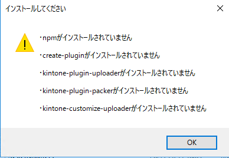

== アプリケーションダウンロード∼実行（AgeAgePlugin）
 
=== ダウンロード
 
. https://github.com/nishikawa-r/AgeAgePlugin/releases[リリースページ] にて最新版のzipファイルをダウンロードする。
. zipファイルを展開する。

=== 実行
. 展開したフォルダの下記のexeファイルを実行 +
`AgeAgePlugin-v[x.x.x.]/bin/Release/AgeAgePlugin.exe`
[tree]
----
AgeAgePlugin-v[x.x.x.]
└─bin
    └─Release
        └─ AgeAgePlugin.exe
----

[IMPORTANT]
====
下記のダイアログが出現した場合は
*1. 各種パッケージインストール*
を行ってください。

====
