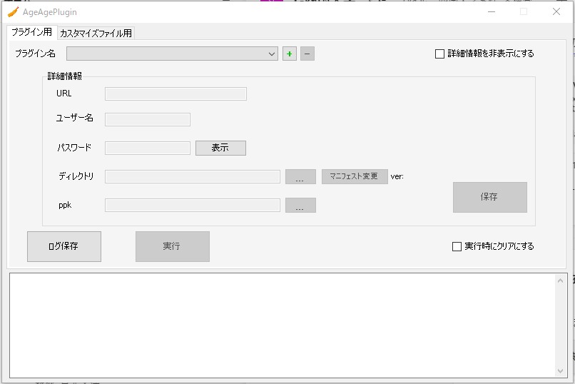

== タブ「プラグイン用」操作説明

=== プラグイン環境名を追加する
.操作方法{counter2:rownum:0}
:!rownum:
[cols=">1,6,18"]
|===
^|No. ^|操作 ^|補足
 
| {counter:rownum}
| プラグインアップロード環境名追加ボタンをクリック
| クリック後、プラグイン名の作成画面に遷移する。
 
| {counter:rownum}
| プラグイン名の作成画面にてプラグイン名を入力
| プラグインのひな型から作成する場合は *create-plugin実行選択チェックボックス* にチェックを入れること。
| {counter:rownum}
| 「追加が完了しました」とダイアログが出現するのでOKボタンを押下する
| 
|===
=== プラグイン環境名を削除する
.操作方法{counter2:rownum:0}
:!rownum:
[cols=">1,6,18"]
|===
^|No. ^|操作 ^|補足
 
| {counter:rownum}
| プラグインアップロード環境削除ボタンをクリック
| 

| {counter:rownum}
| 「削除してもよろしいですか」とダイアログが出現するのでOKボタンを押下する
| ※この際、保存した詳細情報も削除されます。
|===
=== プラグイン環境名を選択する
.操作方法{counter2:rownum:0}
:!rownum:
[cols=">1,6,18"]
|===
^|No. ^|操作 ^|補足
 
| {counter:rownum}
| プラグインアップロード環境名選択コンボボックスをクリック
| 
 
| {counter:rownum}
| 任意の選択項目を選択する
| 選択後、詳細情報の値が環境名選択時に保存した詳細情報の値に変更される。
|===
=== プラグイン環境名に詳細情報を保存する
.操作方法{counter2:rownum:0}
:!rownum:
[cols=">1,6,18"]
|===
^|No. ^|操作 ^|補足
 
| {counter:rownum}
| 詳細情報のURL/ユーザー名/パスワード/ディレクトリ/ppkファイルを入力 or 選択されていることを確認。
| 

| {counter:rownum}
| プラグイン環境詳細情報保存ボタンをクリックする
| 
|===
=== ディレクトリ/ppkファイルの選択
.操作方法{counter2:rownum:0}
:!rownum:
[cols=">1,6,18"]
|===
^|No. ^|操作 ^|補足
 
| {counter:rownum}
| プラグインファイルディレクトリ参照ボタンをクリックする
| 

| {counter:rownum}
| 任意のディレクトリを選択する
| 

| {counter:rownum}
| ppkファイル参照ボタンをクリックする
| 

| {counter:rownum}
| 任意のppkファイルを選択する
| 
|===
[IMPORTANT]
====
ディレクトリは下記の通りに指定すること
----
指定するディレクトリ 
　　　　　　　　└─src 
   　　　　　　　　 └─manifest.json
----
ppkファイルは下記の通りに指定すること
----
指定したディレクトリ 
　　　　　　　　└─指定するppkファイル
----
====
[TIP]
====
*ppkファイルとは* +
秘密鍵ファイルのことであり、2回目以降のプラグインのパッケージングの際に用いる。
====
=== プラグインのアプリ名/アプリバージョン/説明を変更する
.操作方法{counter2:rownum:0}
:!rownum:
[cols=">1,6,18"]
|===
^|No. ^|操作 ^|補足
 
| {counter:rownum}
| マニフェスト変更ボタンをクリック
| その後、manifest.json変更画面に遷移する。

| {counter:rownum}
| manifest.json変更画面のタブ「基本情報」にてアプリ名/アプリバージョン/説明を変更する。
| 

| {counter:rownum}
| manifest.json変更画面にて変更保存ボタンをクリック
| 
|===
=== プラグインに使用するJSファイルのディレクトリを追加する
.操作方法{counter2:rownum:0}
:!rownum:
[cols=">1,6,18"]
|===
^|No. ^|操作 ^|補足
 
| {counter:rownum}
| マニフェスト変更ボタンをクリック
| その後、manifest.json変更画面に遷移する。

| {counter:rownum}
| manifest.json変更画面にてタブ「JS」を選択する
| 

| {counter:rownum}
| 追加ボタンをクリックし任意のファイルを選択する
| ※複数選択可 
|===
[IMPORTANT]
====
JSファイルのディレクトリは下記の通りに指定すること
----
メイン画面　タブ「プラグイン用」ディレクトリ 
　　　　　　　　　　　　　　　└─src 
　　　　　　　　　　　　　　　　　└─指定するJSファイル
----
====
=== プラグインに使用するJSのURLを追加する
.操作方法{counter2:rownum:0}
:!rownum:
[cols=">1,6,18"]
|===
^|No. ^|操作 ^|補足
 
| {counter:rownum}
| マニフェスト変更ボタンをクリック
| その後、manifest.json変更画面に遷移する。

| {counter:rownum}
| manifest.json変更画面にてタブ「JS」を選択する
| 

| {counter:rownum}
| URL追加ボタンをクリックする
| その後、URL追加画面に遷移する

| {counter:rownum}
| URL追加画面の追加URLに任意のURLを入力する
| 

| {counter:rownum}
| URL追加画面のOKボタンをクリックする
| 
|===

=== プラグインに使用するJSファイルのディレクトリを変更する
.操作方法{counter2:rownum:0}
:!rownum:
[cols=">1,6,18"]
|===
^|No. ^|操作 ^|補足
 
| {counter:rownum}
| マニフェスト変更ボタンをクリック
| その後、manifest.json変更画面に遷移する。

| {counter:rownum}
| manifest.json変更画面にてタブ「JS」を選択する
| 

| {counter:rownum}
| リストのJSのディレクトリの値をダブルクリックする
| 

| {counter:rownum}
| JSファイルのディレクトリ選択を行う
| 

|===
[IMPORTANT]
====
JSファイルのディレクトリは下記の通りに指定すること
----
メイン画面　タブ「プラグイン用」ディレクトリ 
　　　　　　　　　　　　　　　└─src 
　　　　　　　　　　　　　　　　　└─指定するJSファイル
----
====
=== プラグインに使用するJSのURLを変更する
.操作方法{counter2:rownum:0}
:!rownum:
[cols=">1,6,18"]
|===
^|No. ^|操作 ^|補足
 
| {counter:rownum}
| マニフェスト変更ボタンをクリック
| その後、manifest.json変更画面に遷移する。

| {counter:rownum}
| manifest.json変更画面にてタブ「JS」を選択する
| 

| {counter:rownum}
| リストのJSのURLの値をダブルクリックする
| その後、URL変更画面に遷移する

| {counter:rownum}
| URL変更画面の変更後URLに任意のURLを入力する
| 

| {counter:rownum}
| URL変更画面のOKボタンをクリックする
| 
|===

=== プラグインに使用するJSファイル/JSのディレクトリ/URLを削除する
.操作方法{counter2:rownum:0}
:!rownum:
[cols=">1,6,18"]
|===
^|No. ^|操作 ^|補足
 
| {counter:rownum}
| マニフェスト変更ボタンをクリック
| その後、manifest.json変更画面に遷移する。

| {counter:rownum}
| manifest.json変更画面にてタブ「JS」を選択する
| 

| {counter:rownum}
| リストのJS/JSファイルのディレクトリ/URLを選択する
| ※複数選択可

| {counter:rownum}
| 削除ボタンをクリックする
| 

|===

=== プラグインに使用するCSSファイルのディレクトリを追加する
.操作方法{counter2:rownum:0}
:!rownum:
[cols=">1,6,18"]
|===
^|No. ^|操作 ^|補足
 
| {counter:rownum}
| マニフェスト変更ボタンをクリック
| その後、manifest.json変更画面に遷移する。

| {counter:rownum}
| manifest.json変更画面にてタブ「CSS」を選択する
| 

| {counter:rownum}
| 追加ボタンをクリックし任意のファイルを選択する
| ※複数選択可 
|===
[IMPORTANT]
====
CSSファイルのディレクトリは下記の通りに指定すること
----
メイン画面　タブ「プラグイン用」ディレクトリ 
　　　　　　　　　　　　　　　└─src 
　　　　　　　　　　　　　　　　　└─指定するCSSファイル
----
====
=== プラグインに使用するCSSのURLを追加する
.操作方法{counter2:rownum:0}
:!rownum:
[cols=">1,6,18"]
|===
^|No. ^|操作 ^|補足
 
| {counter:rownum}
| マニフェスト変更ボタンをクリック
| その後、manifest.json変更画面に遷移する。

| {counter:rownum}
| manifest.json変更画面にてタブ「CSS」を選択する
| 

| {counter:rownum}
| URL追加ボタンをクリックする
| その後、URL追加画面に遷移する

| {counter:rownum}
| URL追加画面の追加URLに任意のURLを入力する
| 

| {counter:rownum}
| URL追加画面のOKボタンをクリックする
| 
|===

=== プラグインに使用するCSSファイルのディレクトリを変更する
.操作方法{counter2:rownum:0}
:!rownum:
[cols=">1,6,18"]
|===
^|No. ^|操作 ^|補足
 
| {counter:rownum}
| マニフェスト変更ボタンをクリック
| その後、manifest.json変更画面に遷移する。

| {counter:rownum}
| manifest.json変更画面にてタブ「CSS」を選択する
| 

| {counter:rownum}
| リストのCSSのディレクトリの値をダブルクリックする
| 

| {counter:rownum}
| JSファイルのディレクトリ選択を行う
| 

|===
[IMPORTANT]
====
CSSファイルのディレクトリは下記の通りに指定すること
----
メイン画面　タブ「プラグイン用」ディレクトリ 
　　　　　　　　　　　　　　　└─src 
　　　　　　　　　　　　　　　　　└─指定するCSSファイル
----
====
=== プラグインに使用するCSSのURLを変更する
.操作方法{counter2:rownum:0}
:!rownum:
[cols=">1,6,18"]
|===
^|No. ^|操作 ^|補足
 
| {counter:rownum}
| マニフェスト変更ボタンをクリック
| その後、manifest.json変更画面に遷移する。

| {counter:rownum}
| manifest.json変更画面にてタブ「CSS」を選択する
| 

| {counter:rownum}
| リストのCSSのURLの値をダブルクリックする
| その後、URL変更画面に遷移する

| {counter:rownum}
| URL変更画面の変更後URLに任意のURLを入力する
| 

| {counter:rownum}
| URL変更画面のOKボタンをクリックする
| 
|===

=== プラグインに使用するCSSファイル/CSSのディレクトリ/URLを削除する
.操作方法{counter2:rownum:0}
:!rownum:
[cols=">1,6,18"]
|===
^|No. ^|操作 ^|補足
 
| {counter:rownum}
| マニフェスト変更ボタンをクリック
| その後、manifest.json変更画面に遷移する。

| {counter:rownum}
| manifest.json変更画面にてタブ「CSS」を選択する
| 

| {counter:rownum}
| リストのCSS/CSSファイルのディレクトリ/URLを選択する
| ※複数選択可

| {counter:rownum}
| 削除ボタンをクリックする
| 

|===

=== プラグインアップロードを実行する

.操作方法{counter2:rownum:0}
:!rownum:
[cols=">1,6,18"]
|===
^|No. ^|操作 ^|補足
| {counter:rownum}
| 詳細情報が正しく入力されていることを確認
| 
| {counter:rownum}
| 実行ボタンをクリックする
| クリック後、「実行を終了」にテキストが変更する。 +
エラーがあった場合、即時に中断され、エラーダイアログが結果として帰ってきます。 +
標準出力はログ内容に出力されます。 +
※監視モードでjs/cssファイルを監視しているので変更を加えれば自動的にパッケージング化されkintone環境にアップロードされます。
|===
[IMPORTANT]
二回目以降やプラグインに変更を加える場合はppkファイルを指定してください。(指定しないとkintone環境にて新規にプラグインが追加されます)

=== プラグインアップロード実行中に処理を終了させる

.操作方法{counter2:rownum:0}
:!rownum:
[cols=">1,6,18"]
|===
^|No. ^|操作 ^|補足
| {counter:rownum}
| 実行を終了ボタンをクリックする
| 押下後、実行が終了される
|===

=== プラグインアップロード実行ログ内容を保存する

.操作方法{counter2:rownum:0}
:!rownum:
[cols=">1,6,18"]
|===
^|No. ^|操作 ^|補足
| {counter:rownum}
| 実行ログ保存ボタンをクリックする
| 
| {counter:rownum}
| ディレクトリ選択後、ログ内容が任意の名前でテキストファイルとして保存される。
| 名前はデフォルトでは `Log_[YYmmdd].txt` となっています。
|===
