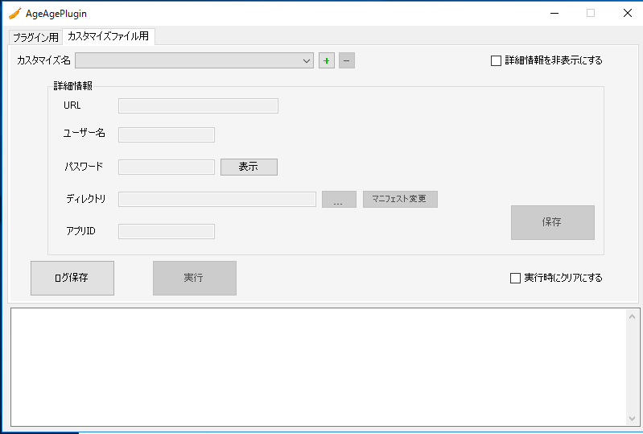

== タブ「カスタマイズファイル用」操作説明

[IMPORTANT]
====
アップロードを行うkintone環境の指定のアプリにすでにカスタマイズファイルがある場合、全てのファイルはcustomize-manifest.jsonで定義したjs/cssに書き換えられてしまうので、必ずカスタマイズがされていないアプリを使用するか、アプリのカスタマイズファイルが消えてもいい環境でのみ実行する様にしてください。
====

=== カスタマイズの環境名を追加する
.操作方法{counter2:rownum:0}
:!rownum:
[cols=">1,6,18"]
|===
^|No. ^|操作 ^|補足
 
| {counter:rownum}
| カスタマイズファイルアップロード環境名追加ボタンをクリック
| クリック後、カスタマイズ名の作成画面に遷移する。
 
| {counter:rownum}
| カスタマイズ名の作成画面にてカスタマイズ名を入力
| カスタマイズアップロードのひな型から作成する場合は *kintone-customize-uploader実行選択チェックボックス* にチェックを入れること。
| {counter:rownum}
| 「追加が完了しました」とダイアログが出現するのでOKボタンを押下する
| 
|===
=== カスタマイズ環境名を削除する
.操作方法{counter2:rownum:0}
:!rownum:
[cols=">1,6,18"]
|===
^|No. ^|操作 ^|補足
 
| {counter:rownum}
| カスタマイズファイルアップロード環境削除ボタンをクリック
| 

| {counter:rownum}
| 「削除してもよろしいですか」とダイアログが出現するのでOKボタンを押下する
| ※この際、保存した詳細情報も削除されます。
|===
=== カスタマイズ環境名を選択する
.操作方法{counter2:rownum:0}
:!rownum:
[cols=">1,6,18"]
|===
^|No. ^|操作 ^|補足
 
| {counter:rownum}
| カスタマイズファイルアップロード環境選択コンボボックスをクリック
| 
 
| {counter:rownum}
| 任意の選択項目を選択する
| 選択後、詳細情報の値が環境名選択時に保存した詳細情報の値に変更される。
|===
=== カスタマイズ環境名に詳細情報を保存する
.操作方法{counter2:rownum:0}
:!rownum:
[cols=">1,6,18"]
|===
^|No. ^|操作 ^|補足
 
| {counter:rownum}
| 詳細情報のURL/ユーザー名/パスワード/ディレクトリ/アプリIDを入力 or 選択されていることを確認。
| 

| {counter:rownum}
| カスタマイズファイル環境詳細情報保存ボタンをクリックする
| 
|===
=== ディレクトリの選択
.操作方法{counter2:rownum:0}
:!rownum:
[cols=">1,6,18"]
|===
^|No. ^|操作 ^|補足
 
| {counter:rownum}
| カスタマイズファイルディレクトリ参照ボタンをクリックする
| 

| {counter:rownum}
| 任意のディレクトリを選択する
| 
|===
[IMPORTANT]
====
ディレクトリは下記の通りに指定すること
----
指定するディレクトリ 
　　　　　　　　└─dest 
   　　　　　　　　　 └─customize-manifest.json
----
====
=== カスタマイズとしてkintone環境に追加するJSファイルのディレクトリを追加する
.操作方法{counter2:rownum:0}
:!rownum:
[cols=">1,6,18"]
|===
^|No. ^|操作 ^|補足
 
| {counter:rownum}
| マニフェスト変更ボタンをクリック
| その後、customize-manifest.json変更画面に遷移する。

| {counter:rownum}
| customize-manifest.json変更画面にてタブ「JS」を選択する
| 

| {counter:rownum}
| 追加ボタンをクリックし任意のファイルを選択する
| ※複数選択可 
|===
[IMPORTANT]
====
JSファイルのディレクトリは下記の通りに指定すること
----
メイン画面　タブ「カスタマイズファイル用」ディレクトリ 
　　　　　　　　　　　　　　　　　└─dest 
　　　　　　　　　　　　　　　　　　　└─指定するJSファイル
----
====
===  カスタマイズとしてkintone環境に追加するJSのURLを追加する
.操作方法{counter2:rownum:0}
:!rownum:
[cols=">1,6,18"]
|===
^|No. ^|操作 ^|補足
 
| {counter:rownum}
| マニフェスト変更ボタンをクリック
| その後、customize-manifest.json変更画面に遷移する。

| {counter:rownum}
| customize-manifest.json変更画面にてタブ「JS」を選択する
| 

| {counter:rownum}
| URL追加ボタンをクリックする
| その後、URL追加画面に遷移する

| {counter:rownum}
| URL追加画面の追加URLに任意のURLを入力する
| 

| {counter:rownum}
| URL追加画面のOKボタンをクリックする
| 
|===

=== カスタマイズとしてkintone環境に変更を加えるJSファイルのディレクトリを変更する
.操作方法{counter2:rownum:0}
:!rownum:
[cols=">1,6,18"]
|===
^|No. ^|操作 ^|補足
 
| {counter:rownum}
| マニフェスト変更ボタンをクリック
| その後、customize-manifest.json変更画面に遷移する。

| {counter:rownum}
| customize-manifest.json変更画面にてタブ「JS」を選択する
| 

| {counter:rownum}
| リストのJSのディレクトリの値をダブルクリックする
| 

| {counter:rownum}
| JSファイルのディレクトリ選択を行う
| 

|===
[IMPORTANT]
====
JSファイルのディレクトリは下記の通りに指定すること
----
メイン画面　タブ「カスタマイズファイル用」ディレクトリ 
　　　　　　　　　　　　　　　　　└─dest 
　　　　　　　　　　　　　　　　　　　└─指定するJSファイル
----
====
=== カスタマイズとしてkintone環境に変更を加えるJSのURLを変更する
.操作方法{counter2:rownum:0}
:!rownum:
[cols=">1,6,18"]
|===
^|No. ^|操作 ^|補足
 
| {counter:rownum}
| マニフェスト変更ボタンをクリック
| その後、customize-manifest.json変更画面に遷移する。

| {counter:rownum}
| customize-manifest.json変更画面にてタブ「JS」を選択する
| 

| {counter:rownum}
| リストのJSのURLの値をダブルクリックする
| その後、URL変更画面に遷移する

| {counter:rownum}
| URL変更画面の変更後URLに任意のURLを入力する
| 

| {counter:rownum}
| URL変更画面のOKボタンをクリックする
| 
|===

=== カスタマイズとして使用するJSファイル/JSのディレクトリ/URLを削除する
.操作方法{counter2:rownum:0}
:!rownum:
[cols=">1,6,18"]
|===
^|No. ^|操作 ^|補足
 
| {counter:rownum}
| マニフェスト変更ボタンをクリック
| その後、customize-manifest.json変更画面に遷移する。

| {counter:rownum}
| customize-manifest.json変更画面にてタブ「JS」を選択する
| 

| {counter:rownum}
| リストのJS/JSファイルのディレクトリ/URLを選択する
| ※複数選択可

| {counter:rownum}
| 削除ボタンをクリックする
| 

|===

=== カスタマイズとしてkintone環境に追加するCSSファイルのディレクトリを追加する
.操作方法{counter2:rownum:0}
:!rownum:
[cols=">1,6,18"]
|===
^|No. ^|操作 ^|補足
 
| {counter:rownum}
| マニフェスト変更ボタンをクリック
| その後、customize-manifest.json変更画面に遷移する。

| {counter:rownum}
| customize-manifest.json変更画面にてタブ「CSS」を選択する
| 

| {counter:rownum}
| 追加ボタンをクリックし任意のファイルを選択する
| ※複数選択可 
|===
[IMPORTANT]
====
CSSファイルのディレクトリは下記の通りに指定すること
----
メイン画面　タブ「カスタマイズファイル用」ディレクトリ 
　　　　　　　　　　　　　　　　　└─dest 
　　　　　　　　　　　　　　　　　　　└─指定するCSSファイル
----
====
===  カスタマイズとしてkintone環境に追加するCSSのURLを追加する
.操作方法{counter2:rownum:0}
:!rownum:
[cols=">1,6,18"]
|===
^|No. ^|操作 ^|補足
 
| {counter:rownum}
| マニフェスト変更ボタンをクリック
| その後、customize-manifest.json変更画面に遷移する。

| {counter:rownum}
| customize-manifest.json変更画面にてタブ「CSS」を選択する
| 

| {counter:rownum}
| URL追加ボタンをクリックする
| その後、URL追加画面に遷移する

| {counter:rownum}
| URL追加画面の追加URLに任意のURLを入力する
| 

| {counter:rownum}
| URL追加画面のOKボタンをクリックする
| 
|===

=== カスタマイズとしてkintone環境に変更を加えるCSSファイルのディレクトリを変更する
.操作方法{counter2:rownum:0}
:!rownum:
[cols=">1,6,18"]
|===
^|No. ^|操作 ^|補足
 
| {counter:rownum}
| マニフェスト変更ボタンをクリック
| その後、customize-manifest.json変更画面に遷移する。

| {counter:rownum}
| customize-manifest.json変更画面にてタブ「CSS」を選択する
| 

| {counter:rownum}
| リストのCSSのディレクトリの値をダブルクリックする
| 

| {counter:rownum}
| CSSファイルのディレクトリ選択を行う
| 

|===
[IMPORTANT]
====
CSSファイルのディレクトリは下記の通りに指定すること
----
メイン画面　タブ「カスタマイズファイル用」ディレクトリ 
　　　　　　　　　　　　　　　　　└─dest 
　　　　　　　　　　　　　　　　　　　└─指定するCSSファイル
----
====
=== カスタマイズとしてkintone環境に変更を加えるCSSのURLを変更する
.操作方法{counter2:rownum:0}
:!rownum:
[cols=">1,6,18"]
|===
^|No. ^|操作 ^|補足
 
| {counter:rownum}
| マニフェスト変更ボタンをクリック
| その後、customize-manifest.json変更画面に遷移する。

| {counter:rownum}
| customize-manifest.json変更画面にてタブ「CSS」を選択する
| 

| {counter:rownum}
| リストのCSSのURLの値をダブルクリックする
| その後、URL変更画面に遷移する

| {counter:rownum}
| URL変更画面の変更後URLに任意のURLを入力する
| 

| {counter:rownum}
| URL変更画面のOKボタンをクリックする
| 
|===

=== カスタマイズとして使用するCSSファイル/CSSのディレクトリ/URLを削除する
.操作方法{counter2:rownum:0}
:!rownum:
[cols=">1,6,18"]
|===
^|No. ^|操作 ^|補足
 
| {counter:rownum}
| マニフェスト変更ボタンをクリック
| その後、customize-manifest.json変更画面に遷移する。

| {counter:rownum}
| customize-manifest.json変更画面にてタブ「CSS」を選択する
| 

| {counter:rownum}
| リストのCSS/CSSファイルのディレクトリ/URLを選択する
| ※複数選択可

| {counter:rownum}
| 削除ボタンをクリックする
| 

|===

=== カスタマイズファイルアップロードを実行する

.操作方法{counter2:rownum:0}
:!rownum:
[cols=">1,6,18"]
|===
^|No. ^|操作 ^|補足
| {counter:rownum}
| 詳細情報が正しく入力されていることを確認
| 
| {counter:rownum}
| 実行ボタンをクリックする
| クリック後、「実行を終了」にテキストが変更する。 +
エラーがあった場合、即時に中断され、エラーダイアログが結果として帰ってきます。 +
標準出力はログ内容に出力されます。 +
※監視モードでjs/cssファイルを監視しているので変更を加えれば自動的にメイン画面で指定したアプリIDを持つアプリのkintone環境にアップロードされます。
|===

=== カスタマイズファイルアップロード実行中に処理を終了させる

.操作方法{counter2:rownum:0}
:!rownum:
[cols=">1,6,18"]
|===
^|No. ^|操作 ^|補足
| {counter:rownum}
| 実行を終了ボタンをクリックする
| 押下後、実行が終了される
|===

=== カスタマイズファイルアップロード実行ログ内容を保存する

.操作方法{counter2:rownum:0}
:!rownum:
[cols=">1,6,18"]
|===
^|No. ^|操作 ^|補足
| {counter:rownum}
| 実行ログ保存ボタンをクリックする
| 
| {counter:rownum}
| ディレクトリ選択後、ログ内容が任意の名前でテキストファイルとして保存される。
| 名前はデフォルトでは `Log_[YYmmdd].txt` となっています。
|===

